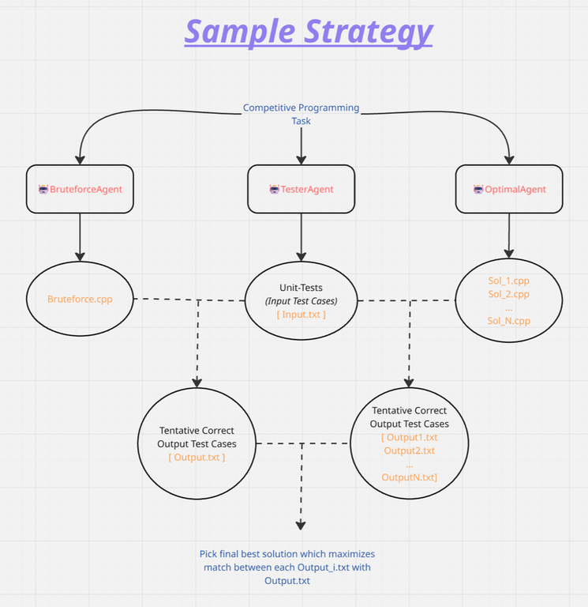

# 🤖 Multi-Agent Meta HackerCup Starter Kit

[](https://www.python.org/downloads/)
[](https://opensource.org/licenses/MIT)
[](https://python.langchain.com/)
[](https://ai.google.dev/)
[](https://www.flamesblue.com)

A multi-agent AI system that collaboratively solves competitive programming problems using iterative refinement with brute-force validation.

## 📖 Description

**Multi-Agent Programming Problem Solver** was originally developed as a **starter kit for Meta Hacker Cup** and similar competitive programming contests. It demonstrates a sample strategy that contestants can experiment with and build upon.

The system employs three specialized AI agents working in concert:
- **TesterAgent** generates small test cases
- **BruteAgent** creates a correct but inefficient solution
- **OptimalAgent** iteratively develops an efficient solution, validated against the brute force output

This approach ensures correctness through differential testing while achieving optimal time complexity through AI-guided iteration.

## 🎯 Overview

### Architecture




## 🚀 Installation

### Prerequisites

- Python 3.8 or higher
- pip package manager

### Step 1: Clone the Repository

```bash
git clone <repository-url>
cd temp-agents
```

### Step 2: Install Dependencies

```bash
pip install -r requirements.txt
```

This installs:
- `langchain` - Multi-agent framework
- `langchain-google-genai` - Google Gemini integration (FREE tier)
- `pyyaml` - Configuration management

### Step 3: Get FREE API Key

**Google Gemini (FREE)**

1. Visit: https://aistudio.google.com/app/apikey
2. Click "Create API Key"
3. Copy the generated key (starts with `AIza...`)

## ⚙️ Configuration

### Set API Key

Edit `config.yaml`:

```yaml
api_keys:
  # Google Gemini API Key - FREE TIER AVAILABLE!
  google: "AIza...your-google-api-key"
```

### Choose Models

The system uses **FREE** Google Gemini models. Default configuration:

```yaml
models:
  tester_agent: "google:gemini-2.5-flash"
  brute_agent: "google:gemini-2.5-flash"
  optimal_agent: "google:gemini-2.5-flash"
```

#### Available Google Gemini Models (FREE Tier)

Check https://ai.google.dev/gemini-api/docs/rate-limits for latest rate limits and free-tier quota.

- `google:gemini-2.5-flash` - Fast, efficient (250 free requests/day)
- `google:gemini-2.5-flash-lite` - Faster, cheaper (1000 free requests/day)
- `google:gemini-2.5-pro` - Most capable (100 free requests/day)


### Adjust Execution Parameters

```yaml
execution:
  max_optimal_attempts: 5      # Maximum retry attempts
  timeout_seconds: 30          # Code execution timeout
```

### Customize Output Directory

```yaml
output:
  workspace_dir: "./workspace"           # Output directory
  preserve_intermediate: true            # Keep all generated files
```

## 📝 Usage

### Step 1: Define Your Problem

Create or edit `PROBLEM.txt` with your problem statement:

```
Given an array of integers, find the maximum sum of any contiguous subarray.

Input Format:
- First line: n (size of array)
- Second line: n space-separated integers

Output Format:
- Single integer: maximum subarray sum

Constraints:
- 1 <= n <= 10^5
- -10^4 <= array[i] <= 10^4

Example:
Input:
5
-2 1 -3 4 -1

Output:
4

Explanation: The subarray [4] has the maximum sum of 4.
```

### Step 2: Run the Solver

```bash
python main.py
```

**What Happens:**

1. **Loads Problem** - Reads `PROBLEM.txt`
2. **Generates Test Cases** - TesterAgent creates 3-5 small test inputs
3. **Creates Brute Force** - BruteAgent generates a correct O(n²-n³) solution
4. **Executes Brute Force** - Saves expected outputs
5. **Optimizes Solution** - OptimalAgent attempts efficient O(n) solution
6. **Validates & Retries** - Compares outputs, retries with feedback if needed
7. **Saves Results** - Generates `workspace/results.json` for the viewer

**Live Progress Indicators:**

```
⠋ Generating test cases with TesterAgent... (00:03)
⠙ Generating brute force solution with BruteAgent... (00:05)
⠹ Generating optimal solution (attempt 1/5)... (00:04)
```

### Step 3: View Results

#### Start HTTP Server

```bash
python -m http.server 8000
```

Then open: http://localhost:8000/viewer.html

*(HTTP server needed to avoid CORS restrictions)*


## 📁 Output Files

All files saved to `workspace/` (configurable):

```
workspace/
├── small_inputs.txt              # Generated test cases
├── small_outputs.txt             # Expected outputs (from brute force)
├── brute.py                      # Brute force solution
├── optimal_attempt_1.py          # First attempt at optimal solution
├── optimal_attempt_1_output.txt  # Output from first attempt
├── optimal_attempt_2.py          # Second attempt (if needed)
├── optimal_attempt_2_output.txt
├── ...                           # Up to 10 attempts
├── optimal.py                    # Final solution
└── results.json                  # Complete metadata for viewer
```


## 📦 Project Structure

```
temp-agents/
├── PROBLEM.txt                   # Your problem statement (REQUIRED)
├── config.yaml                   # Configuration file
├── main.py                       # Entry point
├── orchestrator.py               # Multi-agent coordinator
├── viewer.html                   # Web-based results viewer
├── requirements.txt              # Python dependencies
├── README.md                     # This file
├── QUICKSTART.md                 # Quick reference guide
├── LICENSE                       # MIT License
├── agents/
│   ├── __init__.py
│   ├── tester_agent.py          # Test case generator
│   ├── brute_agent.py           # Brute force solution generator
│   └── optimal_agent.py         # Optimal solution generator
├── utils/
│   ├── __init__.py
│   ├── executor.py              # Code execution utility
│   ├── comparator.py            # Output comparison utility
│   └── progress.py              # Live progress indicators
└── workspace/                    # Generated files (gitignored)
    └── ...
```

## 🤝 Contributing

Contributions are welcome! This is a starter kit meant to be extended and improved. Ideas on how you can extend it is given in the section below.

## 💡 Advanced Tips & Customization for Meta Hacker Cup

- **Add WebSearchAgent** - Allow models to search and learn algorithm approaches on the fly while solving problems
- **Enhance prompts** - Include problem-specific hints (DP, greedy, graph) and complexity targets in agent system prompts
- **Create specialized agents** - Add DebugAgent (analyzes failures), ValidatorAgent (checks logic), or ComplexityAgent (estimates time/space)
- **Provide runtime feedback** - Feed execution time, memory usage, and stack traces to OptimalAgent for faster iteration
- **Parallel solution generation** - Create multiple approaches (DP, greedy, binary search) simultaneously and pick the fastest correct one
- **Problem-specific models** - Detect problem type and choose appropriate models (lighter for practice, stronger for competition)
- **Add support for more programming languages** - Extend beyond Python to support C++, Java, Rust, etc.
- **Implement parallel test execution** - Run multiple test cases simultaneously for faster validation
- **Add complexity analysis display** - Show time/space complexity analysis in the viewer
- **Support for interactive problems** - Handle problems requiring interaction with a judge
- **Multi-file solutions** - Support projects with multiple modules and dependencies
- **Custom test case input** - Allow users to provide their own test cases

## 📄 License

MIT License

Copyright (c) 2025 Nikita Agarwal, Nalin Abrol, Manas Kumar Verma, Nikhil Tadigopulla, Vivek Verma

Permission is hereby granted, free of charge, to any person obtaining a copy
of this software and associated documentation files (the "Software"), to deal
in the Software without restriction, including without limitation the rights
to use, copy, modify, merge, publish, distribute, sublicense, and/or sell
copies of the Software, and to permit persons to whom the Software is
furnished to do so, subject to the following conditions:

The above copyright notice and this permission notice shall be included in all
copies or substantial portions of the Software.

THE SOFTWARE IS PROVIDED "AS IS", WITHOUT WARRANTY OF ANY KIND, EXPRESS OR
IMPLIED, INCLUDING BUT NOT LIMITED TO THE WARRANTIES OF MERCHANTABILITY,
FITNESS FOR A PARTICULAR PURPOSE AND NONINFRINGEMENT. IN NO EVENT SHALL THE
AUTHORS OR COPYRIGHT HOLDERS BE LIABLE FOR ANY CLAIM, DAMAGES OR OTHER
LIABILITY, WHETHER IN AN ACTION OF CONTRACT, TORT OR OTHERWISE, ARISING FROM,
OUT OF OR IN CONNECTION WITH THE SOFTWARE OR THE USE OR OTHER DEALINGS IN THE
SOFTWARE.

## 🙏 Acknowledgments

- **LangChain** - Multi-agent framework
- **Google** - Free Gemini API access
- **FlamesBlue** - Beautiful web viewer
- **KaTeX** - LaTeX rendering
- **Prism.js** - Syntax highlighting
- **Meta** - Inspiration from Hacker Cup

## 🔗 Links

- **Google Gemini API**: https://ai.google.dev/
- **LangChain Documentation**: https://python.langchain.com/
- **Meta Hacker Cup**: https://www.facebook.com/codingcompetitions/hacker-cup
- **FlamesBlue**: https://www.flamesblue.com

---

**Built with ❤️ for the competitive programming community**

*Starter kit for Meta Hacker Cup and similar competitions*

## 🌟 Special Shoutout

<p align="center">
  <a href="https://www.flamesblue.com" target="_blank">
    
  </a>
</p>

<p align="center">
  <strong>Thanks to <a href="https://www.flamesblue.com" target="_blank">FlamesBlue</a> for building the beautiful web viewer!</strong>
</p>
